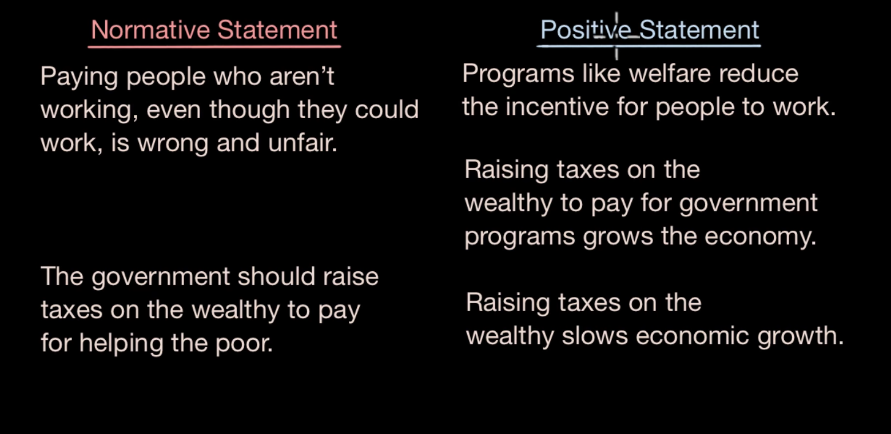

# Basic Economic Concepts

## Scarcity

> In microeconomics, scarcity refers to the idea that **_resources are limited_**. It applies to **physical** resources like land, water, and oil, as well as intangible resources like time, skills, and attention. We have to make choices about how to allocate those resources.

## Four factors of productions:

imagine with a scenario : You are a owner of a farm

1. Land : you need a land to produce crops
2. Labor : Someone needs to work on your land in order to produce it
3. Capital : You need money and resources (electricity , motors etc) to perform the process. Financial assets that can be used in the future
4. Entrepreneurship/technology : Putting together all the other factors of ideas, so that you can produce goods

## Scarcity vs Rivalry

|          Scarcity          |                 Rivalry                  |
| :------------------------: | :--------------------------------------: |
|     limited resources      |           one person at a time           |
| potentially unlimited want | Consumption of one person effects others |

## Normative statements vs Positive statements

> Normative statement are opinions of people when Positive statements can be tested based on data

## [Property Rights](https://www.youtube.com/watch?v=AJy7pWK0W8g&list=PLs5LE24EM-NnnrQhRQuTkA_zVB_wpkmuI&index=7)

- when the property value breaks down , the whole economic system breaks down. And this is called a market failure

---

## 6 key ideas about the economic way of thinking

1. A choice is a trade off.
2. People make rational choices by comparing benefits and cost.
3. Benefit is what you gain from something.
4. Cost is something you must give up to gain something.
5. Most choices are, **_How much _** choice made at the margin
6. Choices responds to **_incentives_**
