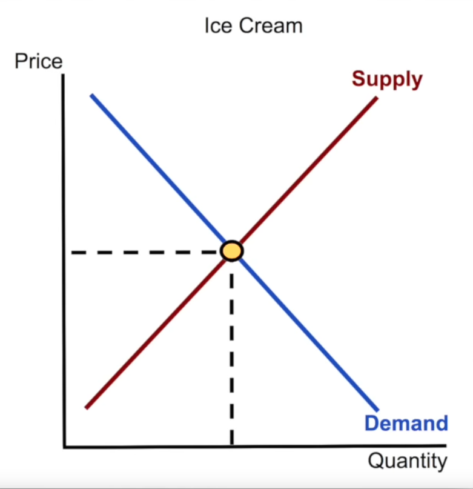
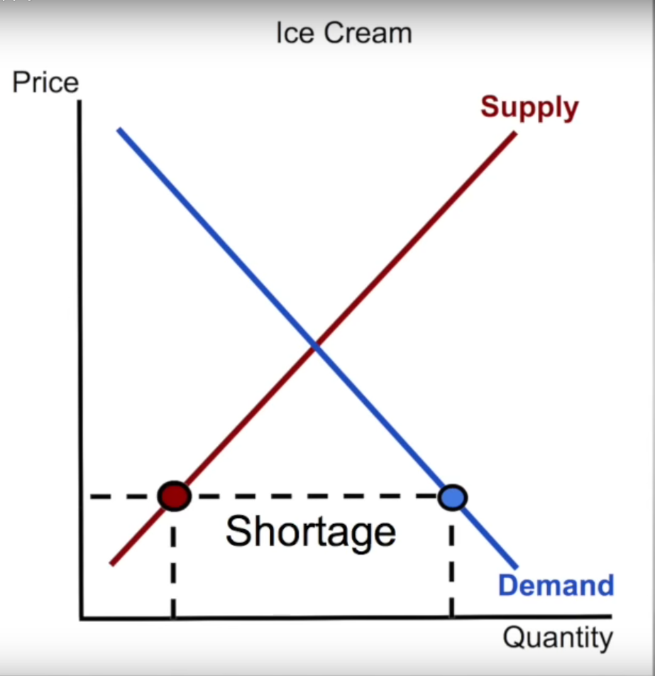
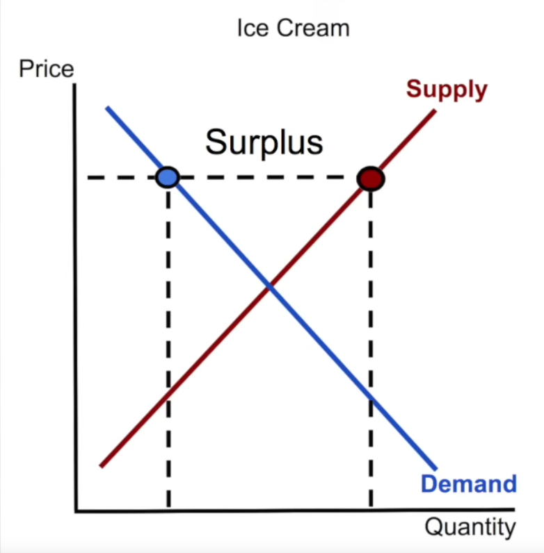
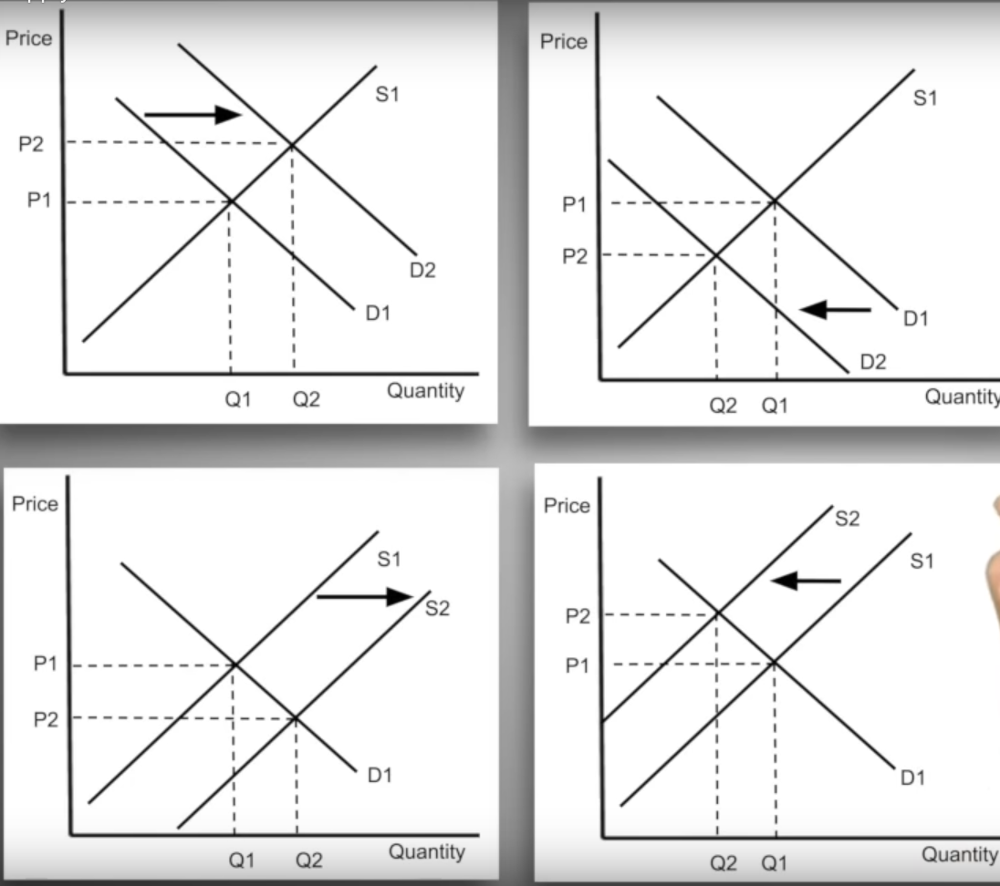
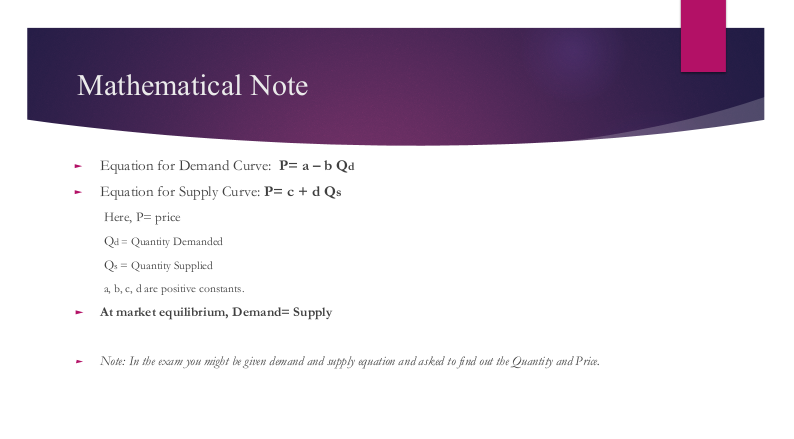

# Demand and Supply

- [Demand, Supply and Market Equilibrium](https://youtu.be/kIFBaaPJUO0)

## 1. Demand

> Shows an inverse relationship between price and quantity demanded. So it's a downward slope

### The law of demand :

- if the price goes up ⏫ , qD goes down ⏬ and ppl want to buy less
- if the price goes down ⏬ , qD goes up ⏫ and ppl want to buy more

### 3 reasons for the law of demand

1. Substitutions effects : when price goes up for ice cream ppl will buy other substitutions products
2. Income effects
3. Law of diminishing Marginal utility: When you enjoy the same thing again ans again, it does not sound enjoyable any more . So in order to get you purchase the product seller has to decrease the price for multiple items.

### 5 shifters of Demand Curve :

1. Preferences : hot day means more ice cream and cold day means less ice cream
2. Number of buyers
3. Price of related goods
   - substitutes
   - complements : same type with different price. eg. cone vs popsicle.
4. income
   - normal goods
   - inferior goods
5. Expectations : if you expect the price to go up in future the qD will increase now

> Increase of the shifters will shift the curve to the right and decrease of the shifter will shift the curve to the left
>
> Price moves along the curve these shift the curve

## 2. Supply

> It's a upward slope.
>
> Shows a positive relationship between price and qS.

- if the price goes up ⏫ , the qS goes up ⏫ because the producers are goint to make more profit out of it.
- if the price goes down ⏬ , qS goes down ⏬ because producers cannot make more profit

> Increase of shifters will move the curve to the right
> Decrease of shifters will move the curve to the left

### 5 shifters of the supply curve

1. Price of resources
2. Technology
3. Government involved
4. Numbers of sellers
5. Expectations : if producers think the price can go up in the future they will hold back the supply for now and sell it in the future when the price goes up.

## All Possible cases in demand and supply curve

1. Change in only Demand
2. Change in only Supply
3. Increase in both
4. Decrease in both
5. Increase in Demand, decrease in supply
6. Decrease in Demand, increase in supply

---

# Equilibrium

> when the `qD = qS`, it's called market equilibrium

## Disequilibrium

#### 1. Shortage : qD > qS

#### 2. Surplus : qD < qS

### 4 cases that can happen

1. D ⏫
2. D ⏬
3. S ⏫
4. S ⏬

#### Equilibrium formula

