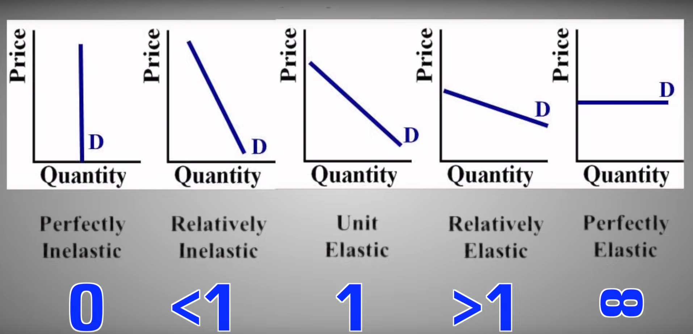
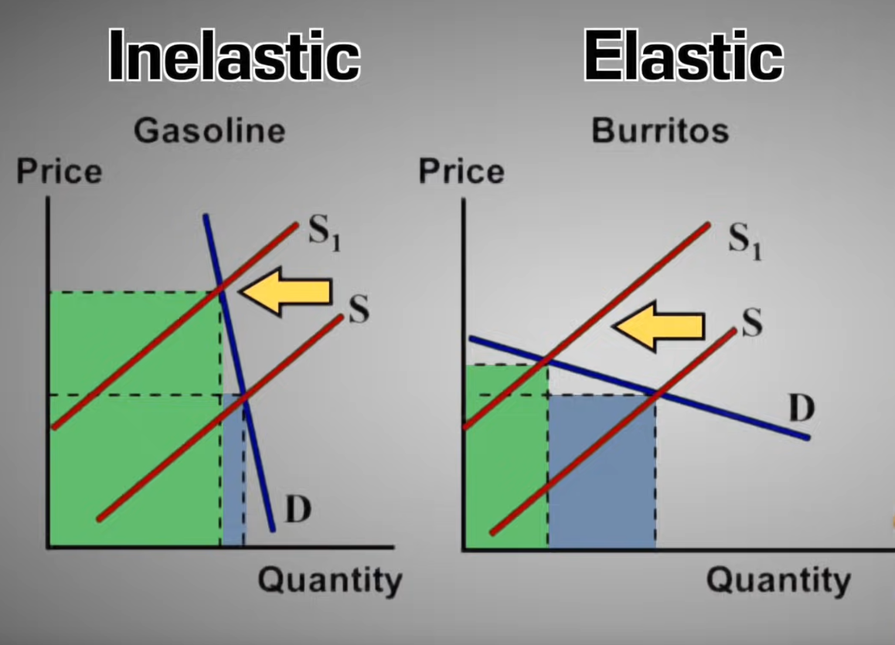

# Referenced videos

- [Elasticity](https://www.youtube.com/watch?v=HHcblIxiAAk)

# Elasticity of Demand

> It involves the price and demand

The law of demand tells us that ppl will buy more if the price goes down and will buy less if the price goes up. That brings the questions how much more or less do ppl buy. That is how the concept of Elasticity comes.

## 2 types of Elasticity demand

1. Inelastic Demand : increase or decrease of the price barely effects the qD or effects just a little bit 🤌 .
2. Elastic Demand : change of qD is sensitive or responsive to price. If price goes up qD decreases a lot and if price goes down, the qD increases a lot

### Elasticity of Demand Coefficient

`% change in qD / % change in p`

- if `EDC < 1` --> Inelastic
- if `EDC > 1` --> Elastic
- if `EDC = 1` --> Unit Elastic Demand
- if `EDC = 0` --> Perfectly Inelastic
- if `EDC = infinity` --> Perfectly Elastic

---

# Total Revenue

> The Total Revenue will provide the information whether a change of price is causing **_elasticity or inelasticity_**.

<u>**Graph Analogy :**</u>

1. For the 1st one the price went up a lot but the qD decreased only a little bit
2. For the 2nd one the price went up a little but the qD decreased a lot

So ,

for <u>**Inelastic:**</u>

- if P ⏫, TR ⏫
- if P ⏬, TR ⏬

for <u>**Elastic:**</u>

- if P ⏫, TR ⏬
- if P ⏬, TR ⏫
