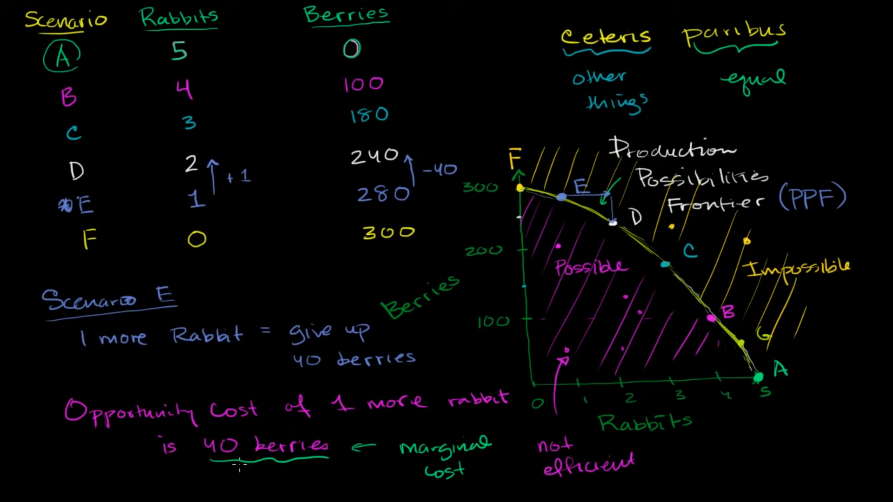

# Opportunity Cost

- every choice along the ppf involves a **_trade off_**
- All trade off involve an opportunity cost
- The opportunity cost of an action is the hightest value alternative foregone. eg. : the opportunity cost of having one more can of cola is the ammount of pizza we are giving up for having it.
- It is based on the change from one scenario to another in the ppf graph. So basically it's the ratio of giving up on one thing in order to achieve another

Lets talk about the scenario E from the picture. If we move from E to D means if we want to have more protine by increasing the number of hunting rabbits from 1 to 2, we have to give up (280-240) = 40 berries.

> So we can say that for scenario E the opportunity cost of having 1 more rabbit is 40 berries. Similarly if we consider from jumping from point E to F, the opportunity cost for (300-280) = 20 barries is 1 rabbit.

> For marginal cost we have determine the opportunity cost for per unit

another way of calculating opportunity cost: [OC](https://www.youtube.com/watch?v=ciju8hN3ius)

## Increasing Opportunity Cost
