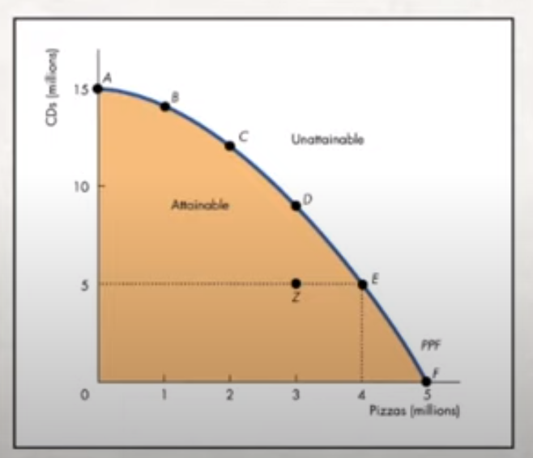
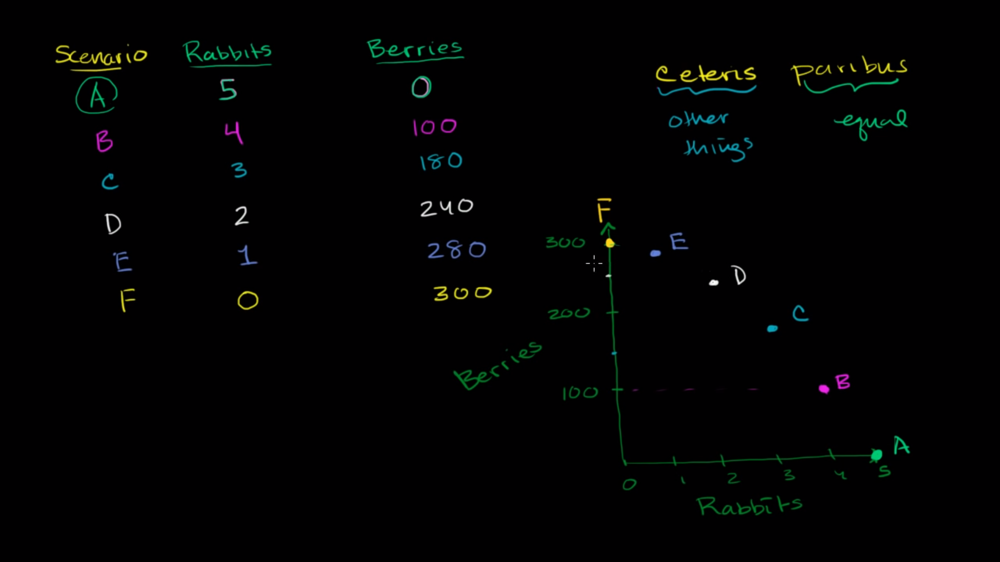

# Production Possibility frontier

# <u>Production Possibilities Frontier</u> 🏗️

- > PPF is the boundary between combinations of goods 💰 and services 🧑🏼‍🏭 that can be produced ✅ and cannot be produced ⛔

- it represents :

  - scarcity 🤕
  - production efficiency 🏭
  - trade-offs 📊
  - opportunity cost 💸

- 

  - inside the blue line production is inefficient (unused resources) and outside of is not efficient means unattainable. On the blue line it is efficient
  - **Analogy :** If we want to produce more pizzas we need to decrease the production of CDs. But notice we need the CDs producers to make pizzas and they will not be as efficient as the pizza makers. So the amount of pizzas production will not drastically change.

### Increasing opportunity cost :

- Sacrificing the production of one thing in order to increase the production of another

#### Better explanation:

- #### [Khan Academy ppf](https://youtu.be/_7VHfuWV-Qg?t=278)

- 

  - All these dotted parts are the possibilities
  - This the curve we call ppf. Because it shows all the possibilities of our actions with available resources

## Unusual term : ceteris paribus - means everthing else is stable
